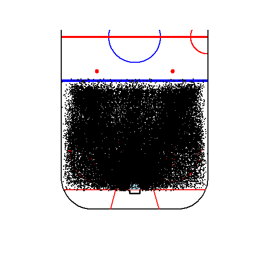
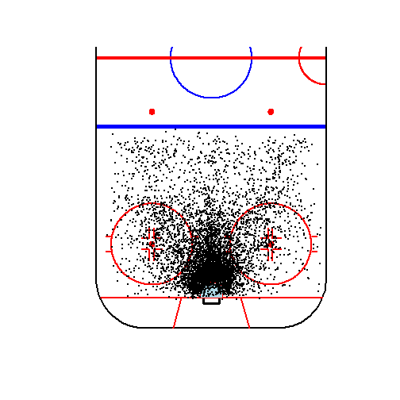

<!-- README.md is generated from README.Rmd. Please edit that file -->


# nhlmodelr: Spatial Modelling of NHL Shot Location Data


Access pre-formatted NHL shot location data and implement spatially explicit models of NHL goal scoring probability. Advanced team, player, and goaltender statistics can be automatically calculated.

## Installation


```r
devtools::install_github("jedalong/nhlmodelr")
```
  
## Quick demo

Load  in some data (2011-12 season) and take a look at the structure.


```r
library(nhlmodelr)
data(shots20112012) 
head(shots20112012)
#>   PLAYID PLYR1.ID       PlyrName PlyrPos TeamID TeamStrength ShotType
#> 1    506      246   Patrik Elias      LW     11          701      805
#> 2    505     3343   David Krejci      C       1          701      803
#> 3    508      816 Bryce Salvador      D      11          701        0
#> 4    508     5490     Mark Fayne      D      11          701        0
#> 5    508     5430   Tyler Seguin      C       1          701        0
#> 6    507     5430   Tyler Seguin      C       1          701      802
#>   ShotDistFt GOALIE.ID     GoalieName gTeamID Goalie   x   y   SEASON
#> 1         14      1207     Tim Thomas       1    901 -76   1 20112012
#> 2         12       108 Martin Brodeur      11    901 -78   1 20112012
#> 3         NA        NA           <NA>       1      0 -70  -7 20112012
#> 4         NA        NA           <NA>       1      0 -42  24 20112012
#> 5         NA        NA           <NA>      11      0 -69 -18 20112012
#> 6         39        NA           <NA>      11    901 -51   0 20112012
#>   PreRegPost    GameID
#> 1          2 400046681
#> 2          2 400046681
#> 3          2 400046681
#> 4          2 400046681
#> 5          2 400046681
#> 6          2 400046681
summary(shots20112012)
#>      PLAYID         PLYR1.ID         PlyrName           PlyrPos         
#>  Min.   :505.0   Min.   :      0   Length:142668      Length:142668     
#>  1st Qu.:506.0   1st Qu.:   1576   Class :character   Class :character  
#>  Median :506.0   Median :   3127   Mode  :character   Mode  :character  
#>  Mean   :506.7   Mean   :  53534                                        
#>  3rd Qu.:508.0   3rd Qu.:   3792                                        
#>  Max.   :508.0   Max.   :2953322                                        
#>                                                                         
#>      TeamID       TeamStrength      ShotType       ShotDistFt    
#>  Min.   : 1.00   Min.   :  0.0   Min.   :  0.0   Min.   :  2.00  
#>  1st Qu.: 8.00   1st Qu.:701.0   1st Qu.:  0.0   1st Qu.: 18.00  
#>  Median :15.00   Median :701.0   Median :802.0   Median : 35.00  
#>  Mean   :15.31   Mean   :696.5   Mean   :598.7   Mean   : 35.89  
#>  3rd Qu.:23.00   3rd Qu.:701.0   3rd Qu.:803.0   3rd Qu.: 50.00  
#>  Max.   :30.00   Max.   :703.0   Max.   :807.0   Max.   :189.00  
#>                                                  NA's   :36294   
#>    GOALIE.ID        GoalieName           gTeamID          Goalie     
#>  Min.   :     72   Length:142668      Min.   : 1.00   Min.   :  0.0  
#>  1st Qu.:   1207   Class :character   1st Qu.: 8.00   1st Qu.:  0.0  
#>  Median :   2339   Mode  :character   Median :15.00   Median :901.0  
#>  Mean   :   2459                      Mean   :15.62   Mean   :672.1  
#>  3rd Qu.:   3502                      3rd Qu.:23.00   3rd Qu.:901.0  
#>  Max.   :2590376                      Max.   :30.00   Max.   :905.0  
#>  NA's   :66292                                                       
#>        x                y                SEASON           PreRegPost   
#>  Min.   :-99.00   Min.   :-42.0000   Min.   :20112012   Min.   :2.000  
#>  1st Qu.:-76.00   1st Qu.:-12.0000   1st Qu.:20112012   1st Qu.:2.000  
#>  Median :-64.00   Median :  1.0000   Median :20112012   Median :2.000  
#>  Mean   :-61.24   Mean   :  0.4313   Mean   :20112045   Mean   :2.068  
#>  3rd Qu.:-49.00   3rd Qu.: 13.0000   3rd Qu.:20112012   3rd Qu.:2.000  
#>  Max.   :  0.00   Max.   : 42.0000   Max.   :20122013   Max.   :3.000  
#>                                                                        
#>      GameID         
#>  Min.   :400046681  
#>  1st Qu.:400047008  
#>  Median :400047343  
#>  Mean   :400061787  
#>  3rd Qu.:400047671  
#>  Max.   :400265531  
#> 
```

Next, format the shots for the spatial model by spatially pooling all the shots to the 5525 unique locations in the offensive zone.


```r
modshots <- shots2model(shots20112012)
head(modshots)
#>     x   y xi ni
#> 1 -89 -42  0  0
#> 2 -88 -42  0  0
#> 3 -87 -42  0  0
#> 4 -86 -42  0  0
#> 5 -85 -42  0  0
#> 6 -84 -42  0  0
```

Set up parameters for the spatial model. First, we need to set the number of Gibbs samples for the MCMC chain and the burn-in. We also need to set-up initial values for each location (here we use random values between 0 and 1). The parameter p.max is the tuning parameter, which is the maximum probability of scoring a goal (in the centre of the goal). Finally, the output filename for storing output \*.RData file needs to be specified (the model produces a single \*.RData file with 8 objects, see  ?NHLmodelr).


```r
ngibbs <- 100
nburnin <- 50
p.max <- 0.29
inits <- runif(dim(modshots)[1],0,1)
outfile <- 'C:/Workspace/NHLModelOutput.RData'

#Model Run - Takes a couple of minutes
df <- NHLmodel(modshots,ngibbs,nburnin,p.max,inits,outfile)
head(df)
#>   x y oldx oldy newx newy      rad    theta index n g p_postmean
#> 1 1 1  -89  -42    0  -42 42.00000 1.570796     1 0 0 0.01163100
#> 2 2 1  -88  -42    1  -42 42.01190 1.546991     2 0 0 0.01453071
#> 3 3 1  -87  -42    2  -42 42.04759 1.523213     3 0 0 0.01816335
#> 4 4 1  -86  -42    3  -42 42.10701 1.499489     4 0 0 0.01860230
#> 5 5 1  -85  -42    4  -42 42.19005 1.475845     5 0 0 0.02204940
#> 6 6 1  -84  -42    5  -42 42.29657 1.452306     6 0 0 0.01787452
#>      p_postvar
#> 1 0.0000976679
#> 2 0.0001395667
#> 3 0.0001332435
#> 4 0.0001595242
#> 5 0.0001829426
#> 6 0.0001440043
```

Their are a number of plotting functions available. We can plot the raw shots data, only the goals, the posterior mean, and the posterior variance.


```r
NHLmodelplot(df,'shots')
#> Error in library(fields): there is no package called 'fields'
```



```r
NHLmodelplot(df,'goals')
#> Error in library(fields): there is no package called 'fields'
```



```r
#NHLmodelplot(df,'postmean')
#NHLmodelplot(df,'postvar')
```

We can also compute advanced team, player, and goaltender spatially adjusted scoring (and save percentage) statistics.


```r
#==== Not Run ====
# teamdb <- teams(df,shots20112012)
# playerdb <- players(df,shots20112012)
# goaliedb <- goalies(df,shots20112012)
#====
```

--- End ---
